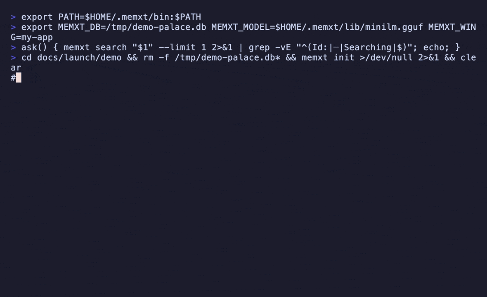
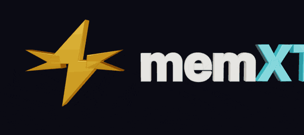

<div align="center">
  

  <p>
    <b>Your coding agent has amnesia. memxt is the cure — and it never leaves your laptop.</b><br/>
    Local long-term memory for <b>Claude Code</b>, Codex, Cursor, and Grok CLI.<br/>
    One palace, every subscription. No cloud, no memory API key, nothing leaves your machine.
  </p>

  <p>
    <a href="https://github.com/Yupcha/memxt/blob/main/LICENSE"></a>
    <a href="#-install"></a>
    <a href="#-proof-not-vibes"></a>
    <a href="#-token-savings"></a>
    <a href="#-proof-not-vibes"></a>
    
  </p>

  

  <p>
    <a href="#-install"><b>Install</b></a> ·
    <a href="#-claude-code-in-30-seconds"><b>Claude Code</b></a> ·
    <a href="#-every-agent-one-palace"><b>Every agent</b></a> ·
    <a href="#-proof-not-vibes"><b>Proof</b></a> ·
    <a href="#how-it-stacks-up"><b>Compare</b></a> ·
    <a href="./docs/harnesses.md"><b>Docs</b></a>
  </p>
</div>

---

## The 3 a.m. feeling

You explained the architecture yesterday. The cart cap is **37**. You banned Redis for a reason. SQLite won the debate.

Today your agent knows **none of it**. So you paste the README again. Re-explain the constraints again. Watch it reintroduce Redis… again.

Cloud "memory layers" fix this by uploading your code and your chat to someone else's server. Hard pass.

**memxt gives your agent a memory palace on your own disk** — one it *searches and writes* as it works, wired straight into the coding loop with MCP + hooks. Verbatim. Local. Yours.

---

## ⚡ Install

```bash
curl -fsSL https://raw.githubusercontent.com/Yupcha/memxt/main/install.sh | bash
```

→ `~/.memxt/bin/memxt` + an on-device MiniLM model. **macOS / Linux**, x86_64 & arm64. No keys, no accounts.

```bash
~/.memxt/bin/memxt adopt --write   # wire up your agents + mine the current repo
~/.memxt/bin/memxt inspect         # palace health
~/.memxt/bin/memxt serve           # browse it → http://127.0.0.1:8765
```

---

## 🪄 Claude Code in 30 seconds

```text
/plugin marketplace add Yupcha/memxt
/plugin install memxt
```

That's the whole setup. From now on, every session just… remembers.

| Fires on | What happens |
|--|--|
| **SessionStart** | Wakes up with identity + project truth + recent work — injected in **~10 ms** |
| **PreCompact** | Saves the conversation **before** context gets crushed |
| **Stop** | Autosaves the turn tail — verbatim, embedded locally, **no cloud LLM** |
| `memory_search` → `memory_get` | Cheap index first, full memory only when needed |
| `/remember` · `/recall` | When you want to be explicit |

```bash
~/.memxt/bin/memxt mine . my-project   # optional: seed the palace from your repo
```

Next session, nobody re-explains the **37-item cart cap**, the **SQLite choice**, or the **Redis ban**. It's just known.

---

## 🧩 Every agent, one palace

One `MEMXT_DB`. Every subscription you already pay for reads and writes the same memory.

| Agent | Setup |
|--|--|
| **Claude Code** | Plugin (above) — the best experience |
| **Codex** | `memxt instructions --harness codex` → `config.toml` + `AGENTS.md` |
| **Cursor** | `memxt adopt --write` → `.cursor/mcp.json` |
| **Grok CLI** | `grok mcp add memory … -- ~/.memxt/bin/memxt mcp`, then start a new session |
| **Any MCP client** | `memxt mcp` over stdio |

```bash
~/.memxt/bin/memxt instructions --harness grok   # also: codex · cursor · zed · claude
```

Standing rules live in [`AGENTS.md`](./AGENTS.md) so agents **know when** to reach for memory — not just how.
Full multi-harness guide (doctor, restart, troubleshooting) → [`docs/harnesses.md`](./docs/harnesses.md).

> MCP loads at session start. After adding memxt, open a **new** session.

---

## ✅ Proof, not vibes

**Coding Continuity Bench — 6/6.** Paraphrased questions (cart **37** / `0x5C`, SQLite vs Postgres, the Redis ban, HttpOnly cookies) + wake-up + profile. Every one recalled.

```bash
./scripts/bench-continuity.sh
```

**Fast where it counts** — Apple Silicon · Metal:

| Op | Time |
|--|--|
| Session **wake-up** | **~10 ms** (no model load) |
| Warm vector search (MCP resident) | **sub-ms** |
| Mine ~15 files | **~1 s** |
| Peak RAM (model loaded) | **~100 MB** |

Method → [`BENCHMARK.md`](./BENCHMARK.md) · details → [`docs/BENCHMARKS_CONTINUITY.md`](./docs/BENCHMARKS_CONTINUITY.md).

---

## 📉 Token savings

Not a synthetic leaderboard. On **this** repo: wire up the agent, mine the project, ask **5 continuity questions**.

```
paste the docs every restart    ████████████████████████████  9,623 tokens
memxt wake + targeted recall     ████████                      2,703 tokens
```

| Path | Into the model | Tokens\* |
|--|--|--:|
| **Without** | README + ROADMAP + AGENTS + docs + recap | **9,623** |
| **With** | `wake_up` + 5× `memory_search` | **2,703** |
| | **Saved** | **6,920 (71.9%) · ~3.6× less** |

<sub>\* `tiktoken` cl100k_base. Honest caveat: a perfect 176-token hand-written recap can look cheaper — but real amnesiac sessions re-dump docs or just fail. Full method → [`docs/TOKEN_SAVINGS.md`](./docs/TOKEN_SAVINGS.md).</sub>

---

## 🏛 How it works

```
                a palace on your disk
                        │
   Wings (projects) → Rooms (topics) → Drawers (verbatim memory + embedding)
                        │
        search  =  vectors + FTS5 + facts + recency, fused
                        │
        wake-up =  who you are + project truth + recent work,  in ~10 ms
```

| Property | Detail |
|--|--|
| **Verbatim** | Your decisions aren't silently rewritten by an LLM |
| **Hybrid search** | Semantic **and** keyword (`0x5C`, function names) **and** fact modes |
| **Profiles** | Stable project facts, with supersession when the truth changes |
| **Dream** | Keeps hot vectors in f32, compresses cold history to **4-bit** (~6× smaller) — infinite past, bounded cost |
| **Local** | MiniLM on-device + SQLite. Zero network at query time |

```bash
memxt search "cart limit" --mode hybrid
memxt search "SQLite" --mode facts --wing my-project
memxt dream --budget 50000        # compress old memories, keep them searchable
memxt serve --port 8765           # inspect / search / dream in the browser
```

---

## How it stacks up

We don't chase cloud LoCoMo / LongMemEval leaderboards. We win the thing you actually feel: **your agent stops forgetting, and your code stays on your machine.**

| | **memxt** | [claude-mem](https://github.com/thedotmack/claude-mem) | [Mem0](https://github.com/mem0ai/mem0) / [Supermemory](https://github.com/supermemoryai/supermemory) |
|--|--|--|--|
| **Runs as** | ~7 MB local binary | Node + Bun worker | Cloud API (+ self-host) |
| **Code leaves machine** | **Never** | Local DB — but compresses via cloud LLM | Yes, by default |
| **Memory LLM bill** | **$0** | Claude / Gemini / OpenRouter | Metered |
| **Works with** | Claude · Codex · Cursor · Grok | Claude-first | Platform |
| **Remembers by** | **Verbatim** + facts + profiles | AI-summarized observations | Extracted entities |
| **Wake-up** | **~10 ms**, no model | Worker inject | Network |

The closest peer is **claude-mem** — genuinely great at automatic Claude capture. If you've hit its cloud-compression costs, or you also live in Grok and Codex, memxt is the same continuity with **zero memory tax** and one palace across all of it.

Full teardown (feature kill-sheet, stack matrix, 8 sharp tools vs 53) → [`research/COMPETITOR_KILL_SHEET.md`](./research/COMPETITOR_KILL_SHEET.md).

```
cloud memory API   ──►  your code + chat leave the building
memxt              ──►  a SQLite palace on disk · 0 API keys · 0 query network
```

---

## CLI

```text
memxt adopt [--write] [--no-mine]    Wire up agents + optionally mine the repo
memxt mine <path> [wing]             Incremental codebase ingest
memxt search <q> --mode hybrid | memories | documents | facts | episodes
memxt wake-up | inspect | dream | serve
memxt forget | export | import | mcp | hook | instructions
```

```bash
MEMXT_DB=~/.memxt/palace.db
MEMXT_MODEL=~/.memxt/lib/minilm.gguf
MEMXT_WING=my-project    # optional; defaults to the git-root name
```

---

## Build from source

Most people never need this. Requires **Zig 0.16** + cmake:

```bash
git clone --recursive https://github.com/Yupcha/memxt && cd memxt
zig build --release=fast   # builds llama.cpp (Metal on macOS) + fetches the MiniLM GGUF
```

Details live in [`install.sh`](./install.sh) and the comments in [`build.zig`](./build.zig).

---

## Roadmap · License · Star

- Roadmap → [`ROADMAP.md`](./ROADMAP.md)
- Launch notes → [`docs/launch/`](./docs/launch/)
- **MIT** → [`LICENSE`](./LICENSE)

<div align="center">

<a href="https://yupcha.github.io/memxt/assets/logo-3d.html" title="Open the interactive 3D logo — drag to orbit">
  
</a>

<sub><a href="https://yupcha.github.io/memxt/assets/logo-3d.html"><b>↑ drag it in 3D</b></a></sub>

**If memxt saves you one re-explain session, [star it](https://github.com/Yupcha/memxt) and tell another Claude Code user.**

That's how local tools win. ⚡

</div>
